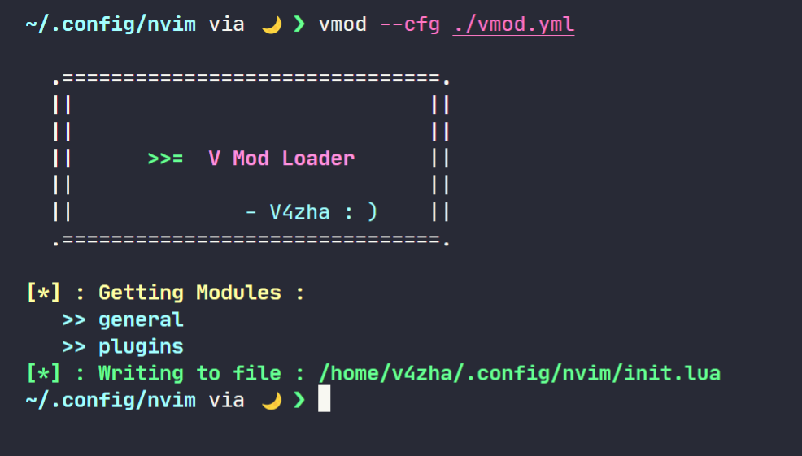

# Vazha Mod Loader

**Vazha Mod Loader** 
is a module bundler to bundle neovim config files written in lua<br>
Vazha Mod Loader provides a fast bundler which looks for modules descibed in the configuration file and bundles all the modules with path namespace in a single lua script.

<br><br>





## Current Features
  
- Provides Configuration file to change config and rebundle.<br>

- Provides custom config path with the optional --cfg flag .

<br>

**Eg:**

 ```bash
  #Displays Vmod version

    vmod -v 

    #q flag to suppress Vmodbanner
    vmod --version -q
 ```

 ```bash
  #Reads config file

    vmod --cfg ./v4zha.yml
    
    vmod -f --quiet ./v4zha.yml
 ```

- Default config location ~/.config/vmod/vmod.yml
- required config fields 

 ```bash
  #Ignores the modules section and finds all modules in mod_path
  
    vmod -a 

    vmod --all
 ```
- Ignores the modules section in the config and auto add all modules in mod_path

```yml
     #Path where Neovim lua modules are located
     #Eg : ~/.config/nvim/lua/v4zha
     mod_path: 
       ~/.config/nvim/lua/v4zha
     #PATH to the New module_bundled lua script 
     res_file: 
       ~/.config/nvim/init.lua
     #List the modules
     #Eg : 
     modules : 
       - general
       - keymaps
       - plugins
       # reads the mod_path for lua scripts : )
       - .
```
## Eg :
```
      📂 ~/.config/nvim
       ├── 📂 lua
       │    └──📂 v4zha
       │       ├──📂 general
       │       │  ├── 📄 utils.lua
       │       │  └── 📄 colorscheme.lua
       │       │
       │       ├──📂 keymaps
       │       │  ├──  📄 leader.lua
       │       │  ├──  📄 terminal.lua
       │       │  └──  📄 general.lua
       │       │
       │       ├──📂 plugins
       │       │  ├── 📄 telescope.lua
       │       │  └── 📄 toggleterm.lua
       │       │  └── 📂 treesitter
       │       │      └── 📄 init.lua
       │       └── 📄 plugin.lua
       │
       └── 📄 init.lua 
```
## generated init.lua 

```lua
      -- ==============================
      -- GENERATED BY V MOD LOADER : )
      -- ==============================

      -- ==============================
      --    MOD : general
      -- ==============================
      require("v4zha.general.utils")
      require("v4zha.general.colorscheme")
      -- ==============================
      --    MOD : keymaps
      -- ==============================
      require("v4zha.keymaps.general")
      require("v4zha.keymaps.terminal")
      require("v4zha.keymaps.leader")
      -- ==============================
      --    MOD : plugin_config
      -- ==============================
      require("v4zha.plugins.toggleterm")
      require("v4zha.plugins.telescope")
      require("v4zha.plugins.treesitter")
      -- ==============================
      --    MOD : v4zha
      -- ==============================
      require("v4zha.plugin")
```


<br>

## Installation
- Download and run installation script [install.sh](https://github.com/v4zha/vmod-loader/releases/latest/install.sh)<br>
OR
- Download from [releases](https://github.com/v4zha/vmod-loader/releases)<br>

## Build   
- Requires cabal,ghc and necessary build tools.
- Configure cabal build using cabal. configure 

```bash
  cabal build
```
to run the binary with arguments in cabal

```bash
  cabal run vmod -- --cfg /location/to/config.yml
  cabal run vmod -- -f -q /location/to/config.yml
```

## Test
- Unit Tests can be found in test directory
to run tests

```bash
  cabal test all
```